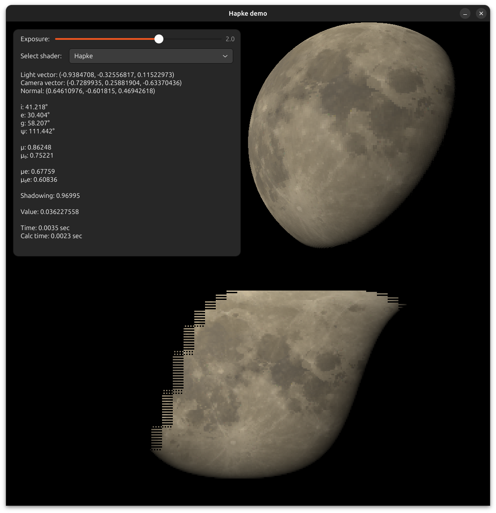

# hapke-demo-rs
Simple demo of Hapke photometric model used for rendering Moon.

Controls: Left-click on map to move the light source, right-click on map to move the camera.

Methodology: [Sato, H., Robinson, M.S., Hapke, B., Denevi, B.W., Boyd, A.K. (2014) Resolved
  Hapke parameter maps of the Moon. Journal of Geophysical Research Planets, 119,
  1775–1805. doi:10.1002/2013JE004580.](https://doi.org/10.1002/2013JE004580)

Parameter source: <https://wms.lroc.asu.edu/lroc/view_rdr/WAC_HAPKEPARAMMAP>